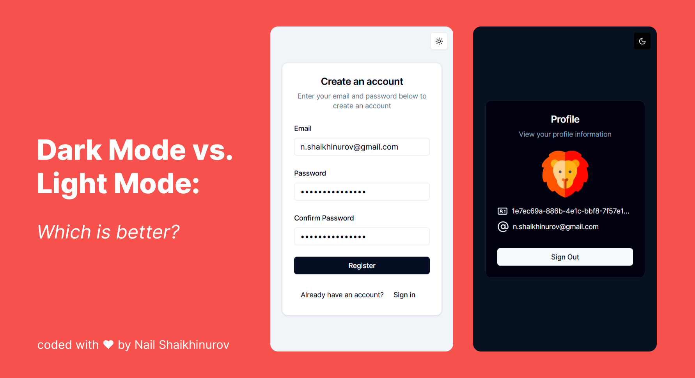

# Auth React Example

[Live Demo on ▲Vercel](https://auth-react-example-nail-shaikhinurovs-projects.vercel.app/)



> A modern React application showcasing authentication (Register/Login) with JWT, theme switching (Dark/Light/System), and best practices in frontend development.

## Table of Contents

1. [Overview](#overview)
2. [Key Features](#key-features)
3. [Tech Stack](#tech-stack)
4. [Architecture](#architecture)
5. [Installation & Setup](#installation--setup)
6. [Known Issues](#known-issues)
7. [License](#license)

## Overview

As a Senior Frontend Developer, I created this project to highlight my approach to **clean code** and best practices in React development, including modern UI libraries, advanced state management, and a thoughtful folder structure for scalable applications.

This project demonstrates a **fully functional authentication flow** (sign-up, sign-in, sign-out) using JWT tokens stored in cookies, along with a user profile page that displays the authenticated user’s information. The design is built using **Tailwind CSS** and **shadcn/ui**, ensuring a modern look and feel. A **Dark/Light/System theme toggle** is also included.

## Key Features

- **Tailwind + shadcn/ui:** Modern, customizable UI components.
- **JWT Auth:** Secure login, registration, and logout with tokens saved in cookies.
- **Form Validation:** Client-side validation using `React Hook Form` + `Zod`.
- **Profile Page:** Fetches and displays user info (`email`, `id`) from a protected endpoint with a fancy animal avatar 🦁.
- **React Query:** Efficient data-fetching and caching for `GET /profile`.
- **Dark/Light/System Theme:** Toggleable theme with preference stored in localStorage.
- **Animations:** Smooth transitions using `Motion (Framer Motion)`.

## Tech Stack

- **[React + TypeScript + Vite](https://vitejs.dev/)**  
  Project bootstrapped with Vite for faster builds and HMR.

- **[Tailwind CSS](https://tailwindcss.com/)**  
  Utility-first CSS framework for rapidly building custom designs.

- **[shadcn/ui](https://ui.shadcn.com/)**  
  A collection of styled components built on top of Radix UI, integrated with Tailwind.

- **[React Query](https://tanstack.com/query/v4)**  
  For efficient server-state management and data-fetching.

- **[React Hook Form](https://react-hook-form.com/) + [Zod](https://github.com/colinhacks/zod)**  
  For form management and robust schema-based validation.

- **[Framer Motion](https://www.framer.com/motion/)**  
  For animations and smooth transitions.

- **[js-cookie](https://github.com/js-cookie/js-cookie)**  
  Handling JWT tokens in cookies (set, get, remove).

- **Feature-Sliced Design (FSD)**  
  Modular folder structure, splitting the codebase into clear layers (features, shared components, etc.).

## Architecture

This repository follows a **Feature-Sliced Design (FSD)** approach, which promotes separation of concerns and scalability. Each major feature (e.g., Auth, Profile) is structured to isolate its pages, services, and components. Shared or UI-level elements are placed in dedicated folders to ensure **maintainability** and **reusability** across the project.

## Installation & Setup

1. **Clone the repository**

   ```bash
   git clone https://github.com/YourUsername/auth-react-example.git
   cd auth-react-example
   ```

2. **Install dependencies (using pnpm)**

   ```bash
   pnpm install
   ```

3. **Start the development server**

   ```bash
   pnpm dev
   ```

   By default, it runs on [http://localhost:5173](http://localhost:5173) (or a similar port).

4. **Build for production**
   ```bash
   pnpm build
   ```

For a live preview, visit the **[▲Vercel deployment](https://auth-react-example-nail-shaikhinurovs-projects.vercel.app/)**.

## Known Issues

- **JWT expiration handling**: Currently, the front-end does not refresh or check token expiration times. If the token is expired, user may need to manually re-login.
- **Validation**: Server-side input validation is minimal (only done on the client side for demonstration purposes).

Despite these minor aspects, the core functionalities are robust and can be extended easily.

## License

This project is open source and available under the [MIT License](LICENSE). Feel free to fork and adapt it to your needs.

**Author**: Nail Shaikhinurov

For any questions or feedback, please contact me via [LinkedIn](https://www.linkedin.com/in/nail-shaikhinurov-00950a2b4/), [email](mailto:n.shaikhinurov@gmail.com) or open an issue in this repository.
